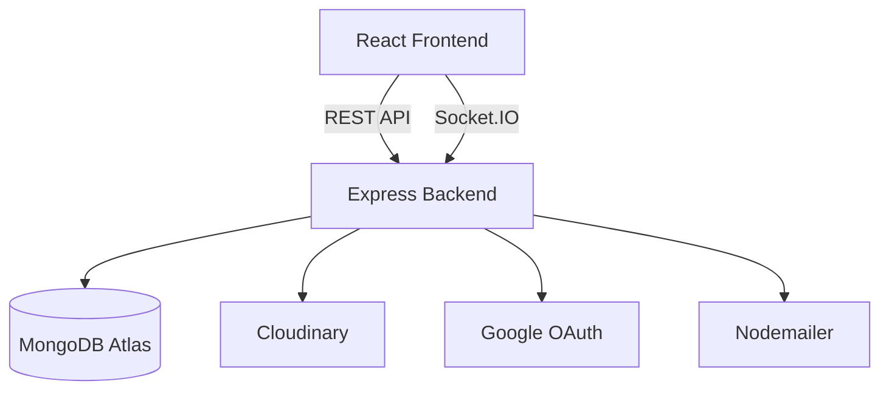
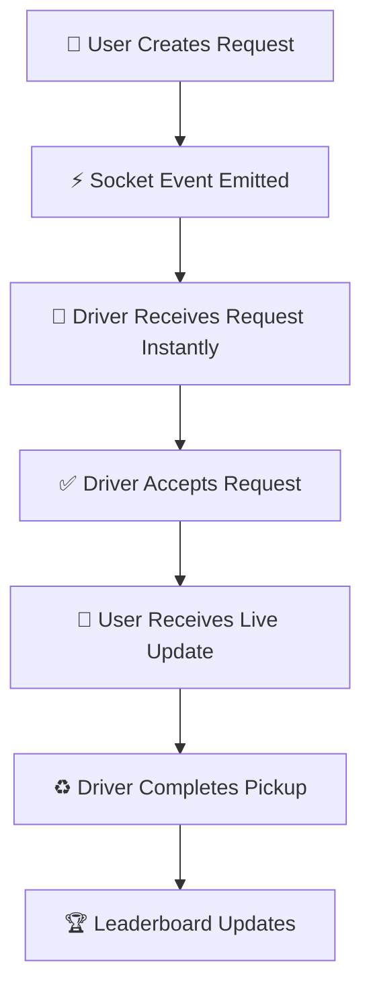
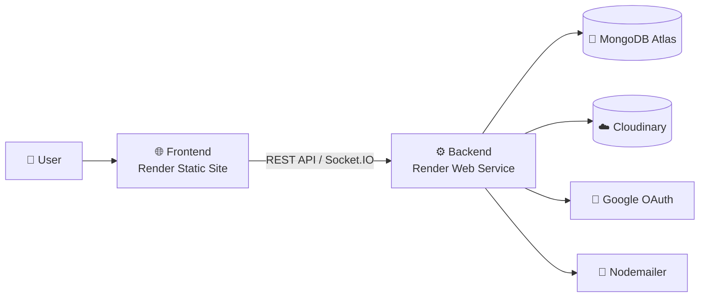

# ♻️ DisposeHub

DisposeHub is a production-ready **MERN Stack** waste disposal platform that connects users and drivers through **real-time request management**.

Users can create disposal requests with images, while drivers receive instant updates, accept requests, complete pickups, and compete on a live leaderboard.

The project demonstrates secure authentication, real-time communication, cloud-based media storage, and production deployment using modern web technologies.


## ⭐ Key Highlights

- 🔐 JWT Authentication with HTTP-only Cookies
- 🌐 Google OAuth Login
- ⚡ Real-time updates using Socket.IO
- 👥 Role-based access for Users & Drivers
- 📷 Cloudinary Image Uploads
- 📧 Email Notifications with Nodemailer
- 🏆 Live Leaderboard
- 🚀 Fully Deployed on Render

## 🚀 Live Demo

| Service | Link |
|---------|------|
| 🌐 Frontend | https://disposehub-client.onrender.com |
| 🔗 Backend API | https://disposehub.onrender.com |

## 📑 Table of Contents

- [⭐ Key Highlights](#-key-highlights)
- [🚀 Live Demo](#-live-demo)
- [✨ Features](#-features)
- [📸 Screenshots](#-screenshots)
- [🏗️ Application Architecture](#️-application-architecture)
- [🛠 Tech Stack](#-tech-stack)
- [📁 Folder Structure](#-folder-structure)
- [🚀 Getting Started](#-getting-started)
- [🔐 Environment Variables](#-environment-variables)
- [📡 API Overview](#-api-overview)
- [🔄 Real-Time Workflow](#-real-time-workflow)
- [🚀 Deployment Architecture](#-deployment-architecture)
- [🚀 Future Improvements](#-future-improvements)
- [👥 Contributors](#-contributors)
- [👨‍💻 Author](#-author)


## ✨ Features

| Module | Features |
|---------|----------|
| Authentication | Email Login, Google OAuth, JWT, Secure Cookies |
| User | Create Requests, Upload Images, Track Status, Notifications |
| Driver | Accept Requests, Complete Pickups |
| Real-Time | Socket.IO, Live Notifications, Live Leaderboard |
| Security | Protected Routes, RBAC, CORS |
| Deployment | Render, MongoDB Atlas, Cloudinary |

## 📸 Screenshots

| Home | User Dashboard |
|------|----------------|
|  |  |

|  **Map Activity**  | **Leaderboard** |
|------------------|-------------|
|  |  |

| **Login** |**Support** |
|-------|----------|
|  |  |


## 🏗️ Application Architecture




## 🛠 Tech Stack

### Frontend


### Backend


### Deployment


## 📁 Folder Structure

```text
DisposeHub
├── client
│   ├── src
│   └── public
├── server
│   ├── controllers
│   ├── middleware
│   ├── models
│   ├── routes
│   ├── sockets
│   └── utils
└── README.md
```

## 🚀 Getting Started

### 1. Clone the repository

```bash
git clone https://github.com/Anujsharma88085/DisposeHub.git
cd DisposeHub
```

### 2. Install dependencies

**Backend**

```bash
cd server
npm install
```

**Frontend**

```bash
cd ../client
npm install
```

### 3. Configure Environment Variables

Create:

- server/.env
- client/.env

Refer to the Environment Variables section below.

### 4. Run the application

Open two terminals.

**Terminal 1 – Server**

```bash
cd server
npm run dev
```

**Terminal 2 – Client**

```bash
cd client
npm run dev
```

## 🔐 Environment Variables

### Server (`server/.env`)

```env
PORT=

MONGO_URI=

JWT_SECRET=
JWT_EXPIRES_IN=
COOKIE_EXPIRES_IN=

GOOGLE_CLIENT_ID=
GOOGLE_CLIENT_SECRET=

BACKEND_URL=
FRONTEND_URL=

CLOUDINARY_CLOUD_NAME=
CLOUDINARY_API_KEY=
CLOUDINARY_API_SECRET=

EMAIL_HOST=
EMAIL_PORT=
EMAIL_USER=
EMAIL_PASSWORD=
```

### Client (`client/.env`)

```env
VITE_API_BASE_URL=
VITE_SOCKET_URL=
```

## 📡 API Overview

| Module | Method | Endpoint |
|--------|:------:|----------|
| **Authentication** | `POST` | `/users/signup` |
| | `POST` | `/users/login` |
| | `GET` | `/auth/google` |
| **User** | `POST` | `/save` |
| | `GET` | `/active-locations` |
| | `PATCH` | `/:id/cancel` |
| **Driver** | `GET` | `/active-locations` |
| | `PATCH` | `/:id/deactivate` |

## 🔄 Real-Time Workflow




## 🚀 Deployment Architecture



## 🚀 Future Improvements

- 🔔 Push Notifications
- 🤖 AI-based Waste Classification
- 📊 Analytics Dashboard


## 👥 Contributors

- [Anuj Kumar Sharma](https://github.com/Anujsharma88085)
- [Abhay Sharma](https://github.com/abhaysharma20233009)
- [Aryan Mishra](https://github.com/aryan-username)

## 👨‍💻 Author

**Anuj Kumar Sharma**

[](https://github.com/Anujsharma88085)
[](https://www.linkedin.com/in/anujsharma88085/)

⭐ If you found this project helpful, consider giving it a star!
